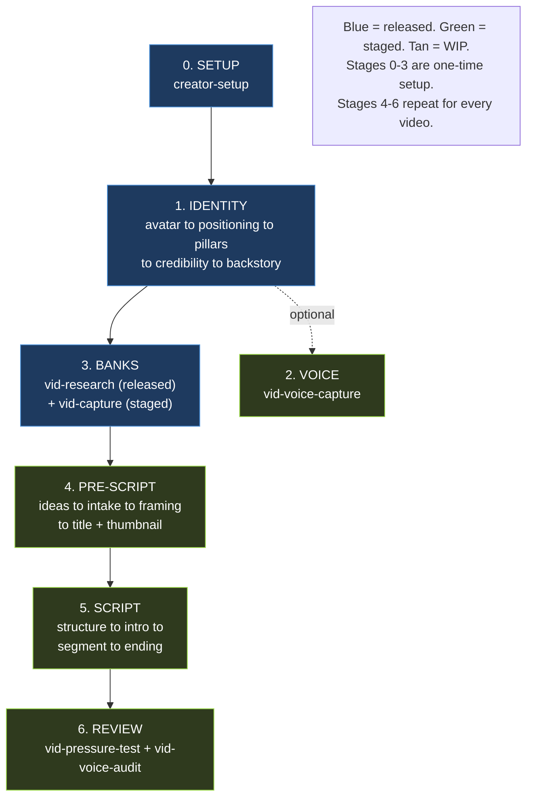
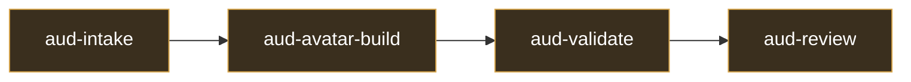

# Authentic AI OS System Map

How the system works, skill by skill. Built from a full audit of all three skill roots (`plugins/authentic-ai-os/skills/`, `.claude/skills/`, `.claude/skills-wip/`), plus `knowledge/`, `banks/`, and `CLAUDE.md`, on 2026-06-19. vid-intake card refreshed 2026-06-24 (Top-3 removal, cold-open lazy-load, voice drop).

**How to read a card:** each skill is a card. `READS` = the context loaded in. `WRITES` = what it produces. `NEXT` = what runs after. `STATUS` = the packaging tier.

**Three tiers, by packaging meaning:**

- `RELEASED` lives in `plugins/authentic-ai-os/skills/` and ships to creators.
- `STAGED` lives in `.claude/skills/`. Works in this repo, not yet released.
- `WIP` lives in `.claude/skills-wip/`. Not ready to ship.

**Three families.** The system runs three skill lines:

- `vid-*` the video pipeline (the backbone: idea to filming-ready script).
- `aud-*` the synthetic-audience pipeline (build avatars from real audience data, then panel-review content).
- `post-*` distribution (turn finished material into platform posts).

Plus one cross-cutting skill, `aaios-feedback`, available throughout.

> This map is a release-process artifact. It is regenerated as a mandatory step whenever a skill graduates (WIP to STAGED to RELEASED) or is parked. See the graduation checklist in `documents/RELEASE.md`, `documents/DEV-WORKFLOW.md`, and the `peak-release` skill.

---

## The video pipeline at a glance

Build the creator's identity once, then the shipped handoff sends them to `vid-research` to fill the pattern banks. Voice capture and per-video stages 4-6 are STAGED (work in this repo, not yet released). The `aud-*` and `post-*` lines are WIP.

---

## Stage 0: Setup

### creator-setup `RELEASED`
Scaffolds the empty vault so every other skill has somewhere to write, and seeds two starter banks.
- **READS**: `knowledge/update-check.md` (pre-flight), `knowledge/vault-integration.md`, the creator's `manifest.md`
- **WRITES**: the workspace folder structure (folders only), plus two seeded banks copied from templates: `banks/hook-bank.md` (from `hook-bank-template.md`) and `banks/transition-bank.md` (from `transition-bank-template.md`). Idempotent, never overwrites creator edits
- **NEXT**: /foundation

---

## Stage 1: Foundation Identity

`/foundation` is a thin orchestrator. It checks what's done and auto-advances the five identity skills in order. All five write into **one shared file**: `creator-foundation.md`.

### /foundation `RELEASED` · orchestrator
Points the creator at the next foundation step. Holds no content itself.
- **READS**: `creator-foundation.md`, `packaging-system.md` (to see what's done), `knowledge/feedback-offer.md`, `knowledge/update-check.md`
- **WRITES**: nothing (offers `vid-research` at Step 5, and `aaios-feedback` via the end-of-journey path)
- **NEXT**: runs avatar to positioning to pillars to credibility to backstory, then offers vid-research

### vid-avatar `RELEASED` · identity 1 of 5
Locks who the viewer is: offer summary, avatar description, Top 3 perceived problems.
- **READS**: `knowledge/interview-posture.md`, `knowledge/vault-integration.md`, `knowledge/creator-foundation-template.md`, `knowledge/update-check.md`, `voice-profile.md` (if it exists)
- **WRITES**: `creator-foundation.md` (Avatar section)
- **NEXT**: vid-positioning

### vid-positioning `RELEASED` · identity 2 of 5
Drafts the Iceberg Statement, the one-sentence channel promise (WHO + WHAT + HOW + TENSION).
- **READS**: `creator-foundation.md` (Avatar, Offer, Top 3), `knowledge/interview-posture.md`, `knowledge/vault-integration.md`, `knowledge/update-check.md`
- **WRITES**: `creator-foundation.md` (Iceberg Statement)
- **NEXT**: vid-pillars

### vid-pillars `RELEASED` · identity 3 of 5
Locks the 8-12 content pillars that deliver on the Iceberg Statement.
- **READS**: `creator-foundation.md` (Iceberg Statement, Top 3), `knowledge/interview-posture.md`, `knowledge/vault-integration.md`, `knowledge/update-check.md`
- **WRITES**: `creator-foundation.md` (Pillars section)
- **NEXT**: vid-credibility

### vid-credibility `RELEASED` · identity 4 of 5
Locks three viewer-relevant credibility brags for intros.
- **READS**: `creator-foundation.md` (Avatar, Top 3), `knowledge/proof-bank-schema.md`, `knowledge/interview-posture.md`, `knowledge/vault-integration.md`, `knowledge/update-check.md`
- **WRITES**: `creator-foundation.md` (Credibility section) + seeds `banks/proof-bank/`
- **NEXT**: vid-backstory

### vid-backstory `RELEASED` · identity 5 of 5
Locks the Problem-Action-Outcome backstory, plus a 3-sentence compressed version.
- **READS**: `creator-foundation.md` (Avatar, Iceberg, Top 3), `knowledge/interview-posture.md`, `knowledge/vault-integration.md`, `knowledge/update-check.md`
- **WRITES**: `creator-foundation.md` (Backstory section)
- **NEXT**: vid-research (offers it at the close, launches on the creator's go). Voice capture is still in development and is not part of the shipped handoff

---

## Stage 2: Foundation Voice

### vid-voice-capture `STAGED`
Captures the creator's voice as a two-part contract: curated reference passages plus a thin guardrail.
- **READS**: `creator-foundation.md`, `raw/voice-sources/` (creator's transcripts/scripts), `knowledge/voice-profile-schema.md`, `knowledge/voice-extraction-methods.md`, `knowledge/voice-pressure-test.md`, `knowledge/voice-rhythm.md`, `knowledge/interview-posture.md`, `knowledge/vault-integration.md`
- **WRITES**: `foundation/reference-pieces/{voice_context}.md` (verbatim passages, the voice engine), `foundation/voice-profile.md` (thin guardrail)
- **NEXT**: optional. Not yet wired into the released handoff chain

---

## Stage 3: Material Banks

Two skills fill the reusable banks. Done once, then topped up over time.

### vid-research `RELEASED`
Studies winning content to build pattern banks and the packaging system. The shipped next step after the foundation identity chain.
- **READS**: `foundation/creator-foundation.md`, `packaging-system.md`, `knowledge/three-circle-research.md`, `knowledge/outlier-identification-rules.md`, `knowledge/format-rotation-guide.md`, `knowledge/packaging-system-template.md`, `knowledge/theory-of-one-curation.md`, `knowledge/interview-posture.md`, `knowledge/thumbnail-text-patterns.md`, `knowledge/update-check.md` (pre-flight), YouTube API key from `.env`
- **WRITES**: `banks/pattern-bank.md`, `banks/title-bank.md`, `banks/power-words-bank.md`, `foundation/packaging-system.md`
- **NEXT**: vid-framing (its close points the creator there for the next video)

### vid-capture `STAGED`
Captures stories, proofs, metaphors, testimonials, and frameworks into the evidence banks.
- **READS**: `creator-foundation.md`, `voice-profile.md` (alignment checks), `knowledge/story-capture-guide.md`, `knowledge/proof-capture-guide.md`, `knowledge/metaphor-builder.md`, `knowledge/testimonial-capture.md`, `knowledge/framework-builder.md`, `knowledge/vault-integration.md`
- **WRITES**: `banks/story-bank/`, `banks/proof-bank/`, `banks/metaphor-bank/`, `banks/testimonial-bank/`, `banks/framework-bank/`, `people/{Name}.md` stubs
- **NEXT**: vid-intake

---

## Stage 4: Pre-Script (per video)

From here, work happens inside one video folder: `content/pieces/{slug}/`. `piece.md` is the **frontmatter hub** every per-video skill reads and updates. The one exception is `vid-ideas`, the optional front-door that runs before any piece folder exists.

### vid-ideas `STAGED` · optional front-door
Generates a batch of signal-backed video ideas when the creator is blank on what to make. Skip it when the creator already has a topic.
- **READS**: `creator-foundation.md` (iceberg, pillars, avatar, Top 3), `banks/pattern-bank.md`, `content/ideas-backlog.md` (if present), `knowledge/iceberg-and-top-3-alignment.md`, `knowledge/theory-of-one-curation.md`, `knowledge/update-check.md` (pre-flight), `knowledge/vault-integration.md`
- **WRITES**: `content/ideas-backlog.md` (kept ideas only). Writes no piece folder
- **NEXT**: vid-intake (hands the picked idea as a seed packet)

### vid-intake `STAGED`
Takes raw material (7 intake modes) and locks the brain-dump for one video. Cold open: loads nothing until a phase needs it. Iceberg-only fit check (no Top 3). No voice load.
- **READS**: `creator-foundation.md` (Phase 4 fit check, not cold), `knowledge/story-capture-guide.md` (only when a thin story needs drilling), `knowledge/update-check.md` (pre-flight), `knowledge/vault-integration.md` (at save). `references/mode-conversation-examples.md` is fallback-only
- **WRITES**: `pieces/{slug}/brain-dump.md`, `pieces/{slug}/piece.md` (standalone). As a sub-skill, returns the packet to the caller and skips the save
- **NEXT**: vid-framing

### vid-framing `STAGED`
Picks the angle, core payoff, and format for the video.
- **READS**: `brain-dump.md`, `piece.md`, `creator-foundation.md`, `banks/pattern-bank.md`, `knowledge/three-circle-research.md`, `knowledge/outlier-identification-rules.md`, `knowledge/audience-temperature-model.md`, `knowledge/format-planners/{format}.md`
- **WRITES**: `piece.md` (angle, payoff, format, goal, viewer stage)
- **NEXT**: vid-title (packaging: title then thumbnail, locked before structure)

### vid-title `STAGED`
Packages the video into a title by exploring angle lanes and leading with the underused on-brand angle, with competitor proof per lane.
- **READS**: `creator-foundation.md`, `packaging-system.md`, `knowledge/BENS-framework.md`, `knowledge/thumbnail-text-patterns.md`, `banks/pattern-bank.md`, `banks/title-bank.md`, `banks/power-words-bank.md`, `piece.md`, `brain-dump.md`
- **WRITES**: `piece.md` (title field)
- **NEXT**: vid-thumbnail (coordinates to avoid repeating words)

### vid-thumbnail `STAGED`
Writes the thumbnail brief: text picks, strategy, BENS rationale.
- **READS**: `packaging-system.md`, `knowledge/thumbnail-strategy-menu.md`, `knowledge/thumbnail-text-patterns.md`, `knowledge/thumbnail-examples-library.md`, `knowledge/thumbnail-composition-guide.md`, `knowledge/BENS-framework.md`, `knowledge/gift-framework.md`, `knowledge/vault-integration.md`, `piece.md`, `banks/packaging-bank/`
- **WRITES**: `pieces/{slug}/thumbnail-brief.md`
- **NEXT**: vid-structure

---

## Stage 5: Scripting (per video)

`script.md` is built up incrementally: structure lays the skeleton, intro/segment/ending fill it in.

### vid-structure `STAGED`
Builds the script skeleton: intro, format-native body sections, ending.
- **READS**: `brain-dump.md`, `piece.md`, `creator-foundation.md`, `voice-profile.md`, `thumbnail-brief.md`, `knowledge/format-planners/{format}.md`, `knowledge/script-tension-architecture.md`, `knowledge/voice-profile-schema.md`, `knowledge/framework-builder.md` (via `assets/script-skeleton-template.md`), all 5 evidence banks
- **WRITES**: `pieces/{slug}/script.md` (skeleton + `## Blocks to capture` manifest), `piece.md` (structure status)
- **NEXT**: gap-fill decision (batch now or inline), then vid-intro. Title and thumbnail are already locked in Pre-Script
- Note: vid-structure does not load `vault-integration.md`, unlike the other writing skills

### vid-intro `STAGED`
Writes the `## Intro` section with the 6-part intro structure.
- **READS**: `piece.md`, `thumbnail-brief.md`, `brain-dump.md`, `creator-foundation.md`, `voice-profile.md`, `reference-pieces/`, `banks/hook-bank.md`, `knowledge/intro-architecture.md`, `knowledge/parable-decision-matrix.md`, `knowledge/story-pulling-criteria.md`, `knowledge/proof-placement-rules.md`, `knowledge/metaphor-integration.md`, `knowledge/visual-proof-callouts.md`, `knowledge/thumbnail-text-patterns.md`, `knowledge/voice-profile-schema.md`, `knowledge/voice-pressure-test.md`, `knowledge/voice-rhythm.md`, `knowledge/vault-integration.md`, `knowledge/format-planners/{format}.md`
- **WRITES**: `script.md` (`## Intro`)
- **NEXT**: vid-segment (hands to vid-voice-update on a creator voice reaction)

### vid-segment `STAGED`
Writes one body section at a time (parable + principle). Loops once per segment.
- **READS**: `piece.md`, `brain-dump.md`, `script.md`, `voice-profile.md`, `reference-pieces/`, `creator-foundation.md`, `banks/transition-bank.md`, all 5 evidence banks, the parable/proof/story/metaphor/visual knowledge set (including `emotion-brick-decision-matrix.md` and `script-tension-architecture.md`), voice set, and `knowledge/format-planners/{format}.md` (see the dependency map for the full 17 + 7 list)
- **WRITES**: `script.md` (one body section), `piece.md` (banks used)
- **NEXT**: vid-segment again until done, then vid-ending (hands to vid-voice-update on a voice reaction)

### vid-ending `STAGED`
Writes the `## Ending` section with the Pivot/Gap/Bridge formula.
- **READS**: `piece.md`, `script.md` (full), `voice-profile.md`, `reference-pieces/`, `creator-foundation.md`, `banks/transition-bank.md`, `knowledge/emotion-brick-decision-matrix.md`, `knowledge/parable-decision-matrix.md`, `knowledge/intro-architecture.md`, `knowledge/story-pulling-criteria.md`, `knowledge/proof-placement-rules.md`, `knowledge/metaphor-integration.md`, `knowledge/visual-proof-callouts.md`, the voice set, `knowledge/vault-integration.md`, `knowledge/format-planners/{format}.md`
- **WRITES**: `script.md` (`## Ending`), `piece.md` (ending status)
- **NEXT**: vid-pressure-test

### vid-voice-update `STAGED` · writing sibling
Triages a mid-draft voice reaction and surgically updates the voice profile when the correction is permanent.
- **READS**: the flagged line + the creator's reaction, `foundation/voice-profile.md`, `knowledge/voice-profile-schema.md`
- **WRITES**: `foundation/voice-profile.md` (refusals only, and only when the correction is permanent). One-time edits rewrite the line in place and save nothing
- **NEXT**: returns control to the calling writing skill with a status packet. Invoked by vid-intro, vid-segment, vid-ending; also callable standalone

---

## Stage 6: Review (per video)

### vid-pressure-test `STAGED`
Audits the assembled script with parallel reviewers, then a read-aloud gate.
- **READS**: `script.md` (full), `piece.md`, `creator-foundation.md`, `voice-profile.md`, `knowledge/script-tension-architecture.md`, `knowledge/voice-profile-schema.md`, `knowledge/intro-architecture.md` (via references/), `knowledge/audience-temperature-model.md` (via references/)
- **WRITES**: `piece.md` (pressure-test audit block), issue comments in `script.md`
- **NEXT**: filming (pipeline ends). Invokes vid-voice-audit as its voice reviewer
- Note: vid-pressure-test no longer loads the `format-planners/` (it did in a prior build)

### vid-voice-audit `STAGED` · review sibling
The single source of voice-truth. Reads the assembled draft against the creator's actual past sentences and flags every line that fails the read-aloud test.
- **READS**: `script.md` (full), `foundation/voice-profile.md`, `foundation/reference-pieces/`, `brand.md`, optional raw transcript samples, `knowledge/voice-pressure-test.md`, `knowledge/voice-profile-schema.md`, `knowledge/voice-rhythm.md`
- **WRITES**: a voice findings list (severity, location, quote, suggested rewrite) plus a per-beat verdict (passes / soft-flag / would-reword)
- **NEXT**: returns control. Runs as the last gate before filming (standalone) or as the voice reviewer inside vid-pressure-test (sub-skill)

---

## The video orchestrator

### vid-pipeline `STAGED` · orchestrator
Thin router for one video, idea to filming-ready script. Reads where a piece is and auto-invokes the next writing skill. Never writes content itself.
- **READS**: `piece.md` and sibling-file presence in `content/pieces/{slug}/`, `knowledge/update-check.md` (pre-flight only). No other knowledge files; the sub-skills own all knowledge loading
- **WRITES**: nothing (delegates to the skill it routes to)
- **ROUTES** (state to next skill): no framing → vid-intake; framed, no format → vid-ideas; format locked, no angle → vid-framing; angle locked, no title → vid-title; title locked, no thumbnail-brief → vid-thumbnail; thumbnail locked, no structure → vid-structure; structure locked, no intro → vid-intro; intro locked, segments incomplete → vid-segment (loop); segments complete, no ending → vid-ending; ending locked, not filming-ready → vid-pressure-test; filming-ready → done

---

## The audience pipeline (`aud-*`)

A separate pipeline that builds synthetic avatars from real audience data, then runs them as a review panel. Four skills, run in order. All `WIP`.

### aud-intake `WIP` · audience 1 of 4
Ingests call transcripts and YouTube comments into the audience-data bank. Calls get full processing; comments are vocabulary samples only. Contamination scan on both.
- **READS**: raw transcripts in `inbox/audience/calls/`, comment exports in `inbox/audience/comments/{video-slug}.csv`, existing `banks/audience-data/` (incremental), `knowledge/synthetic-audience-method.md`, `knowledge/vault-integration.md`
- **WRITES**: `banks/audience-data/calls/{call-slug}.md`, `banks/audience-data/comments/{video-slug}/{id}.md`
- **NEXT**: aud-avatar-build

### aud-avatar-build `WIP` · audience 2 of 4
Clusters audience-data into 4-6 segments and drafts one synthetic avatar per segment (Identity, Top Problems, Top Objections, Vocabulary Bank). Sets aside held-out quotes before drafting.
- **READS**: `banks/audience-data/`, `audience/state.md` (resume state), existing `audience/segments/` and `audience/avatars/` for refresh, `knowledge/synthetic-audience-method.md`, `knowledge/vault-integration.md`
- **WRITES**: `audience/segments/{slug}.md`, `audience/held-out/{slug}.md` (written before drafts), `audience/avatars/{slug}.md` (status: draft)
- **NEXT**: aud-validate

### aud-validate `WIP` · audience 3 of 4
The gate. Three tests per avatar (quote attribution, objection prediction, vocabulary leak). Sets tiered status. The only skill allowed to read held-out quotes.
- **READS**: `audience/avatars/{slug}.md` (status: draft), `audience/held-out/{slug}.md`, `knowledge/common-english.txt`, `knowledge/synthetic-audience-method.md`, `knowledge/vault-integration.md`
- **WRITES**: `audience/avatars/{slug}-validation-{date}.md`, sets avatar `status` to `validated-vocabulary` or `validated-full`
- **NEXT**: aud-review

### aud-review `WIP` · audience 4 of 4
Runs a panel of validated avatars against a script, email, title+thumbnail, hook, or CTA. Each avatar reviews in isolation; median scores with verbatim dissent; verdict-first synthesis.
- **READS**: validated avatars in `audience/avatars/` (status validated-*), `banks/audience-data/` (calibration date check), the piece being reviewed, `knowledge/synthetic-audience-method.md`, `knowledge/vault-integration.md`
- **WRITES**: a review with a verdict (SHIP / FIX-THEN-SHIP / REWRITE)
- **NEXT**: none (terminal; returns to the creator)

---

## The distribution line (`post-*`)

### post-write `WIP`
Turns a batch of raw ideas or a long-form source into individual platform posts, written one at a time in the creator's voice, each run through an anti-slop pass. v1 covers LinkedIn and Instagram (carousel and caption). First skill in the `post-` family.
- **READS**: `creator-foundation.md` (iceberg, Top 3), `voice-profile.md`, `reference-pieces/`, the source (an ideas batch or a long-form piece, including finished `script.md` from the video line), `knowledge/iceberg-and-top-3-alignment.md`, `knowledge/ai-hedging.md`, `knowledge/voice-profile-schema.md`, `knowledge/voice-pressure-test.md`, `knowledge/vault-integration.md`
- **WRITES**: platform posts (LinkedIn argument, Instagram carousel slide copy + visual brief, Instagram caption)
- **NEXT**: none (terminal). Post-type (the shape of the idea) and platform (the delivery) never collapse into each other

---

## Cross-cutting: Feedback

Not a pipeline stage. The feedback channel is available throughout. It surfaces via the offer protocol when a skill fails, when a creator is clearly frustrated, or when a journey completes, and it can be invoked by name any time.

### aaios-feedback `RELEASED`
Captures a creator's feedback on an Authentic AI OS skill and sends it to Billy as a reproduction bundle (a replay case, a snapshot of the determinative vault files, and the bad output) so the bad run can be recreated.
- **READS**: `knowledge/feedback-submit.md` (endpoint + payload + curl recipe), `knowledge/feedback-capture-map.md` (what to capture per skill), `knowledge/feedback-offer.md` (the proactive offer protocol), `knowledge/vault-integration.md`, `.claude-plugin/plugin.json` (version), plus the determinative vault files the capture map names for the skill being reported
- **WRITES**: a local copy at `feedback/{date}-{skill}.md` (record + fallback), and a submission to the `aaios-feedback` form on peak-tools via a public Convex endpoint
- **OFFERED BY**: `/foundation` at the end of the identity chain (Step 5), and any skill via `knowledge/feedback-offer.md`, under a once-per-session guard
- **NEXT**: none (terminal; returns to whatever ran)

Feedback is only invited for **RELEASED** skills (those in `plugins/authentic-ai-os/skills/`). STAGED and WIP skills do not ship, so a creator cannot have run them. The capture map's tiering is the source of truth.

---

## The files that get reused everywhere

A few files carry context across many skills. If you understand these, you understand the data flow.

| File | Who reads it | What it carries |
|------|--------------|-----------------|
| `creator-foundation.md` | every identity, pre-script, script, and post skill | The identity: avatar, iceberg, pillars, credibility, backstory |
| `voice-profile.md` | capture + every writing skill + post-write | The thin voice guardrail, loaded before any prose |
| `foundation/reference-pieces/` | every writing skill, vid-voice-audit, post-write | The verbatim voice engine, the passages prose is written from |
| `piece.md` | every Stage 4-6 skill | Per-video frontmatter hub. Status flags gate the pipeline |
| `knowledge/vault-integration.md` | 20 skills | The routing, frontmatter, and wikilink rules contract |
| `knowledge/voice-profile-schema.md` | 9 skills | The voice-profile structure, loaded by everything that touches voice |

The **5 evidence banks** (story, proof, metaphor, testimonial, framework) are filled once by `vid-capture` and pulled as blocks by `vid-structure` and `vid-segment`. The **audience-data bank** is filled by `aud-intake` and consumed by the rest of the `aud-*` line.

---

## Audit findings

Every skill, knowledge file, and bank was grep-verified on 2026-06-19 against all three skill roots. The wiring is sound. The gaps are all expected for a work-in-progress build.

**Open gaps (expected for a WIP build):**

- **The video orchestrator exists; the other two lines have none yet.** `vid-pipeline` chains the per-video stages 4-6 and is STAGED. The `aud-*` and `post-*` lines have no orchestrator, so they run as manual invokes until one is written. Expected, not a defect.
- **Five bank-schema files are orphaned** (`framework-bank-schema`, `metaphor-bank-schema`, `packaging-bank-schema`, `story-bank-schema`, `testimonial-bank-schema`). They are staged ahead of `vid-capture`, which currently loads the matching `-builder` and `-capture` guides instead. They wire up when vid-capture is finished. See the dependency map, section 3.
- **`aaios-feedback` skips the update-check pre-flight** that the other eight released skills run. Intentional for a terminal cross-cutting skill that runs mid-session after another skill already checked.
- **Two decision-matrix files coexist** (`parable-decision-matrix.md`, `emotion-brick-decision-matrix.md`), both consumed by vid-segment and vid-ending. The `emotion-brick-*` name predates the Block System rename to parable/principle and may be legacy. Worth a content audit before either skill ships.

**Verified as correct (not issues):**

- **Knowledge files all wired, with five known exceptions.** Every file in `knowledge/` except the five orphaned bank-schemas is referenced by at least one skill. The capture/placement guides load conditionally deep in skill bodies, not always in header read-lists.
- **`thumbnail-composition-guide.md` is loaded** by vid-thumbnail. It was an intentional orphan in an early map; it no longer is.
- **The `hook-bank` / `transition-bank` references resolve.** They were re-architected as vault banks (`banks/hook-bank.md`, `banks/transition-bank.md`) seeded by creator-setup from `hook-bank-template.md` and `transition-bank-template.md`. No broken references remain.
- **`/foundation` and `vid-backstory` both hand off to `vid-research`.** The shipped foundation chain offers vid-research at the close and launches it on the creator's go. Voice capture is STAGED and not yet part of the released handoff.
- **`vid-avatar` reading `voice-profile.md` is correctly guarded** with "if it exists". Voice capture runs later, and the skill handles its absence cleanly.

**Note on the `foundation/` folder:** in this dev repo `creator-foundation.md` sits at the root with no `foundation/` directory. That is expected. The client installer scaffolds `foundation/` on setup. Not a bug.
