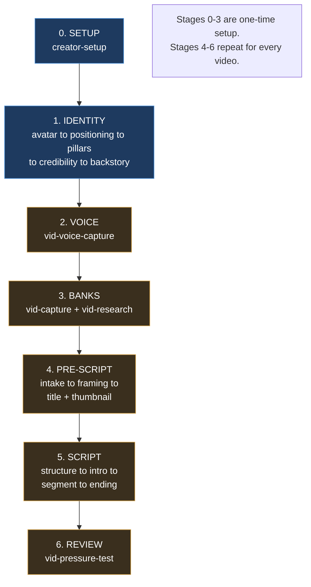

# Authentic AI OS System Map

How the system works, skill by skill. Built from a full audit of `.claude/skills/`, `.claude/skills-wip/`, `knowledge/`, `banks/`, and `CLAUDE.md` on 2026-05-20.

**How to read a card:** each skill is a card. `READS` = the context loaded in. `WRITES` = what it produces. `NEXT` = what runs after. `STATUS` = shipped or work in progress.

---

## The pipeline at a glance

Blue = shipped. Tan = work-in-progress. The whole journey: build the creator's identity and voice once, fill the reusable banks once, then run stages 4-6 for each video.

---

## Stage 0: Setup

### creator-setup `SHIPPED`
Scaffolds the empty vault so every other skill has somewhere to write.
- **READS**: nothing (creator passes in a `manifest.md`)
- **WRITES**: the `Authentic-AI-OS/` folder structure (folders only, no content)
- **NEXT**: /foundation

---

## Stage 1: Foundation Identity

`/foundation` is a thin orchestrator. It checks what's done and auto-advances the five identity skills in order. All five write into **one shared file**: `creator-foundation.md`.

### /foundation `SHIPPED` · orchestrator
Points the creator at the next foundation step. Holds no content itself.
- **READS**: `creator-foundation.md`, `packaging-system.md` (to see what's done)
- **WRITES**: nothing
- **NEXT**: runs avatar → positioning → pillars → credibility → backstory

### vid-avatar `SHIPPED` · identity 1 of 5
Locks who the viewer is: offer summary, avatar description, Top 3 perceived problems.
- **READS**: `knowledge/interview-posture.md`, `knowledge/vault-integration.md`, `knowledge/creator-foundation-template.md`, `voice-profile.md` (if it exists)
- **WRITES**: `creator-foundation.md` (Avatar section)
- **NEXT**: vid-positioning

### vid-positioning `SHIPPED` · identity 2 of 5
Drafts the Iceberg Statement, the one-sentence channel promise (WHO + WHAT + HOW + TENSION).
- **READS**: `creator-foundation.md` (Avatar, Offer, Top 3), `knowledge/BENS-framework.md`, `knowledge/interview-posture.md`, `knowledge/vault-integration.md`
- **WRITES**: `creator-foundation.md` (Iceberg Statement)
- **NEXT**: vid-pillars

### vid-pillars `SHIPPED` · identity 3 of 5
Locks the 8-12 content pillars that deliver on the Iceberg Statement.
- **READS**: `creator-foundation.md` (Iceberg Statement, Top 3), `knowledge/interview-posture.md`
- **WRITES**: `creator-foundation.md` (Pillars section)
- **NEXT**: vid-credibility

### vid-credibility `SHIPPED` · identity 4 of 5
Locks three viewer-relevant credibility brags for intros.
- **READS**: `creator-foundation.md` (Avatar, Top 3), `knowledge/proof-bank-schema.md`, `knowledge/interview-posture.md`, `knowledge/vault-integration.md`
- **WRITES**: `creator-foundation.md` (Credibility section) + seeds `banks/proof-bank/`
- **NEXT**: vid-backstory

### vid-backstory `SHIPPED` · identity 5 of 5
Locks the Problem-Action-Outcome backstory, plus a 3-sentence compressed version.
- **READS**: `creator-foundation.md` (Avatar, Iceberg, Top 3), `knowledge/interview-posture.md`, `knowledge/vault-integration.md`
- **WRITES**: `creator-foundation.md` (Backstory section)
- **NEXT**: vid-voice-capture

---

## Stage 2: Foundation Voice

### vid-voice-capture `WIP`
Captures the creator's voice as a two-part contract: a thin guardrail + verbatim sample passages.
- **READS**: `creator-foundation.md`, `raw/voice-sources/` (creator's transcripts/scripts), `knowledge/voice-profile-schema.md`, `knowledge/voice-extraction-methods.md`, `knowledge/voice-pressure-test.md`, `knowledge/interview-posture.md`, `knowledge/vault-integration.md`
- **WRITES**: `voice-profile.md` (thin guardrail), `foundation/reference-pieces/{context}.md` (verbatim passages)
- **NEXT**: vid-capture or vid-research

---

## Stage 3: Material Banks

Two skills fill the reusable banks. Done once, then topped up over time.

### vid-capture `WIP`
Captures stories, proofs, metaphors, testimonials, and frameworks into the evidence banks.
- **READS**: `creator-foundation.md`, `voice-profile.md` (alignment checks)
- **WRITES**: `banks/story-bank/`, `banks/proof-bank/`, `banks/metaphor-bank/`, `banks/testimonial-bank/`, `banks/framework-bank/`, `people/{Name}.md` stubs
- **NEXT**: vid-intake

### vid-research `WIP`
Studies winning content to build pattern banks and the packaging system.
- **READS**: `creator-foundation.md`, `packaging-system.md`, `knowledge/three-circle-research.md`, `knowledge/outlier-identification-rules.md`, YouTube API key from `.env`
- **WRITES**: `banks/pattern-bank.md`, `banks/title-bank.md`, `banks/power-words-bank.md`, `packaging-system.md`
- **NEXT**: vid-intake

---

## Stage 4: Pre-Script (per video)

From here, work happens inside one video folder: `content/pieces/{slug}/`. `piece.md` is the **frontmatter hub** every per-video skill reads and updates. The one exception is `vid-ideas`, the optional front-door that runs before any piece folder exists.

### vid-ideas `WIP` · optional front-door
Generates a batch of signal-backed video ideas when the creator is blank on what to make. Skip it when the creator already has a topic.
- **READS**: `creator-foundation.md` (iceberg, pillars, avatar, Top 3), `banks/pattern-bank.md` (synthesis + confirmed winners + dropped), `content/ideas-backlog.md` (if present)
- **WRITES**: `content/ideas-backlog.md` (kept ideas only)
- **NEXT**: vid-intake (hands the picked idea as a seed packet)

### vid-intake `WIP`
Takes raw material (7 intake modes) and locks the brain-dump for one video.
- **READS**: `creator-foundation.md`, `voice-profile.md`
- **WRITES**: `pieces/{slug}/brain-dump.md`, `pieces/{slug}/piece.md`
- **NEXT**: vid-framing

### vid-framing `WIP`
Picks the angle, core payoff, and format for the video.
- **READS**: `brain-dump.md`, `piece.md`, `creator-foundation.md`, `banks/pattern-bank.md`, `knowledge/vault-integration.md`
- **WRITES**: `piece.md` (angle, payoff, format, goal, viewer stage)
- **NEXT**: vid-title (packaging: title then thumbnail, locked before structure)

### vid-title `WIP`
Writes the video title using BENS and validated patterns.
- **READS**: `creator-foundation.md`, `packaging-system.md`, `knowledge/BENS-framework.md`, `banks/title-bank.md`, `banks/packaging-bank/`, `piece.md`, `brain-dump.md`
- **WRITES**: `piece.md` (title field)
- **NEXT**: vid-thumbnail (coordinates to avoid repeating words)

### vid-thumbnail `WIP`
Writes the thumbnail brief: text picks, strategy, BENS rationale.
- **READS**: `packaging-system.md`, `knowledge/thumbnail-strategy-menu.md`, `knowledge/thumbnail-text-patterns.md`, `knowledge/thumbnail-examples-library.md`, `knowledge/BENS-framework.md`, `knowledge/gift-framework.md`, `knowledge/vault-integration.md`, `piece.md`, `banks/packaging-bank/`
- **WRITES**: `pieces/{slug}/thumbnail-brief.md`
- **NEXT**: vid-structure

---

## Stage 5: Scripting (per video)

`script.md` is built up incrementally: structure lays the skeleton, intro/segment/ending fill it in.

### vid-structure `WIP`
Builds the script skeleton: intro, format-native body sections, ending.
- **READS**: `brain-dump.md`, `piece.md`, `creator-foundation.md`, `voice-profile.md`, `thumbnail-brief.md`, `knowledge/format-planners/{format}.md`, `knowledge/script-tension-architecture.md`, all 5 evidence banks
- **WRITES**: `pieces/{slug}/script.md` (skeleton + `## Blocks to capture` manifest), `piece.md` (structure status)
- **NEXT**: gap-fill decision (batch now or inline), then vid-intro. Title and thumbnail are already locked in Pre-Script; structure never calls them.

### vid-intro `WIP`
Writes the `## Intro` section with the 6-part intro structure.
- **READS**: `piece.md`, `thumbnail-brief.md`, `brain-dump.md`, `creator-foundation.md`, `voice-profile.md`, `reference-pieces/`, `banks/hook-bank.md`, `knowledge/intro-architecture.md`, `knowledge/script-tension-architecture.md`, `knowledge/vault-integration.md`
- **WRITES**: `script.md` (`## Intro`)
- **NEXT**: vid-segment

### vid-segment `WIP`
Writes one body section at a time (Setup/Tension/Payoff). Loops once per segment.
- **READS**: `piece.md`, `brain-dump.md`, `script.md`, `voice-profile.md`, `reference-pieces/`, `creator-foundation.md`, `knowledge/script-tension-architecture.md`, `knowledge/parable-decision-matrix.md`, `knowledge/visual-proof-callouts.md`, `knowledge/vault-integration.md`, all 5 evidence banks + `banks/transition-bank.md`
- **WRITES**: `script.md` (one body section), `piece.md` (banks used)
- **NEXT**: vid-segment again until done, then vid-ending

### vid-ending `WIP`
Writes the `## Ending` section with the Pivot/Gap/Bridge formula.
- **READS**: `piece.md`, `script.md` (full), `voice-profile.md`, `reference-pieces/`, `creator-foundation.md`, `banks/transition-bank.md`
- **WRITES**: `script.md` (`## Ending`), `piece.md` (ending status)
- **NEXT**: vid-pressure-test

---

## Stage 6: Review (per video)

### vid-pressure-test `WIP`
Audits the assembled script with 4 parallel reviewers, then a read-aloud gate.
- **READS**: `script.md` (full), `piece.md`, `creator-foundation.md`, `voice-profile.md`, `knowledge/script-tension-architecture.md`, `knowledge/vault-integration.md`
- **WRITES**: `piece.md` (pressure-test audit block), issue comments in `script.md`
- **NEXT**: filming (pipeline ends)

---

## The files that get reused everywhere

Four files carry context across many skills. If you understand these, you understand the data flow.

| File | Who reads it | What it carries |
|------|--------------|-----------------|
| `creator-foundation.md` | 13 skills, every stage | The identity: avatar, iceberg, pillars, credibility, backstory |
| `voice-profile.md` | capture + every writing skill | The thin voice guardrail, loaded before any prose |
| `piece.md` | every Stage 4-6 skill | Per-video frontmatter hub. Status flags gate the pipeline |
| `knowledge/vault-integration.md` | 10+ skills | The routing, frontmatter, and wikilink rules contract |

The **5 evidence banks** (story, proof, metaphor, testimonial, framework) are filled once by `vid-capture` and pulled as "blocks" by `vid-structure` and `vid-segment`.

---

## Audit findings

Every skill, knowledge file, and bank was grep-verified on 2026-05-21. The wiring is sound. One real gap, and it's expected for a work-in-progress build.

**The one real finding:**

**No `vid-pipeline` orchestrator exists yet.** Ten WIP skills reference `vid-pipeline` as the orchestrator that chains stages 4-6, but there is no `vid-pipeline/` skill folder. It's planned but unbuilt. Stages 4-6 are manual invokes until it's written. Expected gap, not a defect.

**Verified as correct (not issues):**

- **Knowledge files all wired.** Every file in `knowledge/` is referenced by at least one skill. The capture/placement guides (`story-capture-guide.md`, `proof-placement-rules.md`, `metaphor-builder.md`, `voice-rhythm.md`, etc.) load conditionally deep in skill bodies, not in header read-lists. `thumbnail-composition-guide.md` is intentionally reserved for the future `vid-thumbnail-gen` skill.
- **One title bank.** `title-bank.md` holds the research-mined patterns plus the creator's curated set in one file (creator edits in place). vid-title loads it. vid-framing loads `pattern-bank.md` for angle selection, not a title bank.
- **`/foundation` to `vid-voice-capture` handoff is correct.** The `/foundation` chain explicitly points the creator at vid-voice-capture but does not auto-invoke it, because that skill needs source material the creator brings. Documented and intentional.
- **`vid-avatar` reading `voice-profile.md` is correctly guarded** with "if it exists". Voice capture runs later in the sequence, and the skill handles its absence cleanly.

**Note on the `foundation/` folder:** in this dev repo `creator-foundation.md` sits at the root with no `foundation/` directory. That is expected. The client installer scaffolds `foundation/` on setup. Not a bug.
