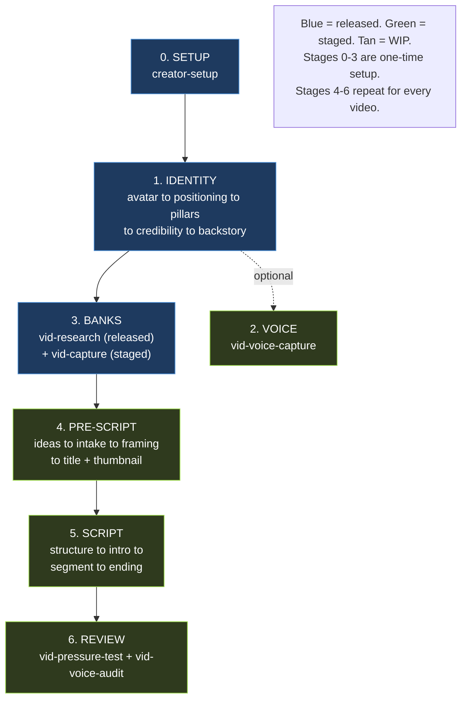

# Authentic AI OS System Map

How the system works, skill by skill. Regenerated 2026-07-21 from a full audit of all three skill roots (`plugins/authentic-ai-os/skills/`, `.claude/skills/`, `.claude/skills-wip/`), plus `knowledge/`, `banks/`, and `CLAUDE.md`. Every READS line is derived from the skill's own load sections by grep, not carried over from the prior map. Dev-only `WORKING-NOTES.md` files are excluded from the derivation.

**How to read a card:** each skill is a card. `READS` = the context loaded in. `WRITES` = what it produces. `NEXT` = what runs after. `STATUS` = the packaging tier.

**Three tiers, by packaging meaning:**

- `RELEASED` lives in `plugins/authentic-ai-os/skills/` and ships to creators.
- `STAGED` lives in `.claude/skills/`. Works in this repo, not yet released.
- `WIP` lives in `.claude/skills-wip/`. Not ready to ship.

**Three families.** The system runs three skill lines:

- `vid-*` the video pipeline (the backbone: idea to filming-ready script).
- `aud-*` the synthetic-audience pipeline (build avatars from real audience data, then panel-review content).
- `post-*` distribution (turn finished material into platform posts).

Plus one cross-cutting skill, `aaios-feedback`, available throughout.

> This map is a release-process artifact. It is regenerated as a mandatory step whenever a skill graduates (WIP to STAGED to RELEASED) or is parked. See the graduation checklist in `documents/RELEASE.md`, `documents/DEV-WORKFLOW.md`, and the `peak-release` skill.

---

## The video pipeline at a glance

Build the creator's identity once, then the shipped handoff sends them to `vid-research` to fill the pattern banks. Voice capture and per-video stages 4-6 are STAGED (work in this repo, not yet released). The `aud-*` and `post-*` lines are WIP.

---

## Stage 0: Setup

### creator-setup `RELEASED`
One-time installer that scaffolds the workspace into the folder the creator names as their content home, working only inside that folder (never scanning above or below it). It is manifest-driven: it reads `manifest.md`, builds folders only for currently-released skills, and carries the seed mechanics for starter banks (copy-if-absent, so a creator's edited bank is never overwritten). Routing has three branches: detect an existing workspace and run an additive update, flat-scaffold an empty directory, or inspect a populated vault by reading inside every plausible content-home candidate before recommending one. It always writes a scoped workspace `CLAUDE.md` plus a `.env.example`, never destroys creator content, and closes with a state-aware handoff to `/foundation` or `vid-research` depending on what is already locked.
- **READS**: `knowledge/update-check.md` (pre-flight), `knowledge/vault-integration.md`, the creator's `manifest.md`
- **WRITES**: the workspace folder structure (folders only, per the manifest's current-release table). Two seed rows sit in the manifest's pending table: `banks/hook-bank.md` (from `hook-bank-template.md`) and `banks/transition-bank.md` (from `transition-bank-template.md`), going live when vid-intro, vid-segment, and vid-ending ship
- **NEXT**: /foundation

---

## Stage 1: Foundation Identity

`/foundation` is a thin orchestrator. It checks what's done and auto-advances the five identity skills in order. All five write into **one shared file**: `creator-foundation.md`.

### /foundation `RELEASED` · orchestrator
Thin orchestrator that runs no interviews itself. It does two silent checks: a workspace check (if `foundation/` and the workspace `CLAUDE.md` are missing it runs `creator-setup` first), then a state check that reads `creator-foundation.md` to see which sections are filled (Offer, Avatar, Top 3, Iceberg, Pillars, Credibility, Backstory). It maps that state to the next of five identity sub-skills, tells the creator in plain language what is locked and what comes next, then auto-invokes that skill with no friction step. It honors stop signals ("hold on", "stop here") by halting the chain, and once all five sections lock it offers `vid-research` as the only next step.
- **READS**: `creator-foundation.md`, `packaging-system.md` (to see what's done), `knowledge/feedback-offer.md`, `knowledge/update-check.md`
- **WRITES**: nothing (offers `vid-research` at Step 5, and `aaios-feedback` via the end-of-journey path)
- **NEXT**: runs avatar to positioning to pillars to credibility to backstory, then offers vid-research

### vid-avatar `RELEASED` · identity 1 of 5
The first foundation interview, a three-phase conversation that locks who the viewer is and writes Offer, Avatar, and Top 3 perceived problems. It asks one question at a time with an absorb-first posture, mirroring answers that spill across phases instead of re-asking. Phase 1 captures the Offer, Phase 2 the Avatar as a plain few-sentence description (never a structured field set), Phase 3 three genuinely different problems in the viewer's own language, using a "disappearance probe" ("if they already had that, what would disappear?") to turn solutions into problems. Every phase enforces a show-before-save gate where the creator locks the exact wording out loud, and Top 3 (flagged as where this skill most often fails) caps sharpening at two rounds per problem.
- **READS**: `knowledge/interview-posture.md`, `knowledge/vault-integration.md`, `knowledge/creator-foundation-template.md`, `knowledge/update-check.md`, `voice-profile.md` (if it exists)
- **WRITES**: `creator-foundation.md` (Avatar section)
- **NEXT**: vid-positioning

### vid-positioning `RELEASED` · identity 2 of 5
The second foundation skill, a drafting skill (not discovery) that produces the one-sentence Iceberg Statement. It hard-requires Offer, Avatar, and Top 3 to exist first, then builds from four internal components (WHO + WHAT + HOW + TENSION), where HOW is the differentiating mechanism and TENSION is a named enemy or refused axis that keeps the line from sounding like 1000 other channels. It drafts exactly two candidates that vary only the TENSION, never three rewordings of one template, then iterates in the creator's exact language under a read-aloud test. A literal-words rule preserves any short enemy phrase the creator repeated (like "cry it out") verbatim, and bland drafts get silently rejected against three checks: could 1000 channels say it, can the viewer picture searching it, does the creator reword it.
- **READS**: `creator-foundation.md` (Avatar, Offer, Top 3), `knowledge/interview-posture.md`, `knowledge/vault-integration.md`, `knowledge/update-check.md`
- **WRITES**: `creator-foundation.md` (Iceberg Statement)
- **NEXT**: vid-pillars

### vid-pillars `RELEASED` · identity 3 of 5
The third foundation skill, a discovery interview that locks 8 to 12 content pillars as short 1-to-4-word labels. Its defining move is root-cause framing: a pillar is not a category that sounds like the niche but another sub-problem that, when broken in the avatar's life, blocks the Iceberg promise (so if the Iceberg promises YouTube growth, "YouTube growth" cannot be a pillar). It proposes a starter list mined from the Top 3, the Offer and Avatar, and standard root causes the creator may not have named, then pushes tactics and single tools off the list with a "could you make 10 videos on this without repeating yourself?" test. It validates the full set ("if the avatar fixed all of these, would they get the promise?"), adds anything missing, enforces a floor of 8, and saves short labels only.
- **READS**: `creator-foundation.md` (Iceberg Statement, Top 3), `knowledge/interview-posture.md`, `knowledge/vault-integration.md`, `knowledge/update-check.md`
- **WRITES**: `creator-foundation.md` (Pillars section)
- **NEXT**: vid-credibility

### vid-credibility `RELEASED` · identity 4 of 5
The fourth foundation skill. It deliberately over-collects proof through sharp one-at-a-time prompts (personal results, client wins, recognized-authority proof, volume proof) then ranks it down to three viewer-relevant brags, each Big, Specific, Personal, declarative past tense, one number per sentence. The ranking pass is made visible to the creator and runs a false-belief test (a brag that kills a false belief beats a bigger number that kills nothing), an Iceberg-tension coverage check, and a mandatory anti-proof check that rewrites any brag reading as if the creator produced the failure. It writes twice: the locked three to the foundation verbatim, and every leftover strong proof point as its own `banks/proof-bank/` entry. It offers fallback brags for creators with no numbers yet.
- **READS**: `creator-foundation.md` (Avatar, Top 3), `knowledge/proof-bank-schema.md`, `knowledge/bank-contract.md`, `knowledge/interview-posture.md`, `knowledge/vault-integration.md`, `knowledge/update-check.md`
- **WRITES**: `creator-foundation.md` (Credibility section) + seeds `banks/proof-bank/` (pulled downstream by vid-intro, vid-segment, vid-ending, and vid-structure)
- **NEXT**: vid-backstory

### vid-backstory `RELEASED` · identity 5 of 5
The fifth and final foundation interview, locking a Problem-Action-Outcome backstory (1 to 2 conversational paragraphs plus a 3-sentence compressed intro version). It hard-requires Avatar and Iceberg first, then runs four questions with absorb-first posture: the starting state with numbers, the specific trigger, the concrete moves (flagged as where most backstories fail, demanding what they stopped, started, and tried that failed rather than "I built a system"), and the measurable outcome including any setback. It pushes hard against corporate tone and vague struggle, and never fabricates a detail the creator can't recall. For professionals who never had the avatar's problem, it swaps "you" for a clearly attributed real client and creates a wikilinked person stub. Since it completes the identity chain, it offers `vid-research` rather than auto-chaining.
- **READS**: `creator-foundation.md` (Avatar, Iceberg, Top 3), `knowledge/interview-posture.md`, `knowledge/vault-integration.md`, `knowledge/update-check.md`
- **WRITES**: `creator-foundation.md` (Backstory section)
- **NEXT**: vid-research (offers it at the close, launches on the creator's go). Voice capture is still in development and is not part of the shipped handoff

---

## Stage 2: Foundation Voice

### vid-voice-capture `STAGED`
Builds the creator's voice engine in two artifacts and deliberately stores no statistics or rhythm numbers. It runs a six-stage flow: write every source to disk under `raw/voice-sources/` before analysis (including pasted transcripts), group by `voice_context` (youtube-script, shorts, linkedin), then pull 3 to 8 verbatim intact passages per context, each with a plain-language `> Demonstrates:` line. Patterns that hold across contexts become the thin guardrail; single-context patterns stay in the reference pieces; single-source ones drop. It enforces a source floor (3 to 5 short-form pieces or ~5,000 words long-form), asks which live-delivered improvised moments to never draft (those become refusals, never seeds), and the read-aloud gate is absolute: nothing enters either file until the creator confirms it out loud. It produces `foundation/reference-pieces/{voice_context}.md` files plus a thin `voice-profile.md`, then stops without auto-invoking anything.
- **READS**: `creator-foundation.md`, `raw/voice-sources/` (creator's transcripts/scripts), `knowledge/voice-profile-schema.md`, `knowledge/voice-extraction-methods.md`, `knowledge/voice-pressure-test.md`, `knowledge/voice-rhythm.md`, `knowledge/interview-posture.md`, `knowledge/vault-integration.md`
- **WRITES**: `foundation/reference-pieces/{voice_context}.md` (verbatim passages, the voice engine), `foundation/voice-profile.md` (thin guardrail)
- **NEXT**: optional. Not yet wired into the released handoff chain

---

## Stage 3: Material Banks

Two skills fill the reusable banks. Done once, then topped up over time.

### vid-research `RELEASED`
Builds and refreshes the creator's three pattern banks from real YouTube data so downstream skills ground decisions in what audiences actually click. It runs Three-Circle Research (the creator's own channel, about 5 direct competitors, 3 to 5 adjacent channels), pulling data via a YouTube API key from `.env` (never hallucinated), setting a per-channel outlier floor off the median, recording every video that clears it, and running thumbnail vision classification on a studied subset. The hard rule between circles: adjacent niches contribute only transferable structure (title shapes, power words, thumbnail moves, formats), never topics. An LLM synthesis spread-ranks patterns across channels, then a Theory of One human curation pass (Keep / Drop / Modify per pattern, in plain language, drops kept sticky) decides what survives. It saves the three bank files plus a light `packaging-system.md` (a 3+1 format rotation and 1 to 2 thumbnail strategies to test), runs in three modes (full first build, quarterly refresh, 5-to-10-minute single-outlier add), and saves partial state after every phase so it resumes cleanly. It is the next step the foundation identity chain points to.
- **READS**: `foundation/creator-foundation.md`, `packaging-system.md`, `knowledge/three-circle-research.md`, `knowledge/outlier-identification-rules.md`, `knowledge/format-rotation-guide.md`, `knowledge/packaging-system-template.md`, `knowledge/theory-of-one-curation.md`, `knowledge/interview-posture.md`, `knowledge/thumbnail-text-patterns.md`, `knowledge/update-check.md` (pre-flight), YouTube API key from `.env`
- **WRITES**: `banks/pattern-bank.md`, `banks/title-bank.md`, `banks/power-words-bank.md`, `foundation/packaging-system.md`
- **NEXT**: vid-framing (its close points the creator there for the next video)

### vid-capture `STAGED`
A looped, single-item bank-capture skill with five stage flows (story, metaphor, proof, testimonial, framework) that runs standalone (loops after every save) or as a sub-skill another vid- skill calls mid-script (captures one item, returns its wikilink, skips the loop). The defining move is a dig-deeper requirement: it refuses the first pass and plans 2 to 3 probing rounds for the exact number or the worst-moment detail, then runs a dedup scan against existing bank files before saving. Each stage has its own logic (stories capture Problem-Action-Outcome and locate the lesson second, metaphors classify visual versus non-visual, testimonials stay verbatim with no cleanup, frameworks handle only the log path). Any named client auto-creates a `people/{Full Name}.md` stub with a bidirectional wikilink, and the entry is not saved if the stub fails. Anti-fabrication is absolute: if a prompt yields nothing, it writes "no story here yet" rather than inventing one.
- **READS**: `creator-foundation.md`, `voice-profile.md` (alignment checks), `knowledge/story-capture-guide.md`, `knowledge/framework-builder.md`, `knowledge/bank-contract.md`, plus skill-local `references/metaphor-builder.md`, `references/proof-capture-guide.md`, `references/testimonial-capture.md`
- **WRITES**: `banks/story-bank/`, `banks/proof-bank/`, `banks/metaphor-bank/`, `banks/testimonial-bank/`, `banks/framework-bank/`, `people/{Name}.md` stubs
- **NEXT**: vid-intake

---

## Stage 4: Pre-Script (per video)

From here, work happens inside one video folder: `content/pieces/{slug}/`. `piece.md` is the **frontmatter hub** every per-video skill reads and updates. The one exception is `vid-ideas`, the optional front-door that runs before any piece folder exists.

### vid-ideas `STAGED` · optional front-door
The optional front-door for the blank-slate moment; skip it when the creator already has a topic. It hard-stops if `creator-foundation.md` or `banks/pattern-bank.md` is missing, then generates roughly 5 to 6 ideas one at a time off a five-step spine: start from a real winning title (the seed may stay close to the source because the picked idea is provisional until vid-title writes the final title), name the single load-bearing element that drove its multiple as a form not a theme (a number, a hot proper noun, a parenthetical kicker, a named system; a dull synonym for the source's sharp word is a floor failure), carry that engine onto the creator's topic, run the side-by-side sharpness test (the bend next to the source line and the plain unbent topic line; if either out-clicks it, the idea failed, and borrowing the source's numbers or hot words is allowed), and gate on iceberg fit. The hard anti-fabrication rule is that every anchored idea must cite a real per-channel row (actual title, channel, views, multiplier); 1 to 2 unproven experimental swings are allowed but flagged. An in-session dial (sharper / more / tighter / wilder / different pillar / regenerate) re-rolls the batch until the creator picks. It writes only keepers to `content/ideas-backlog.md`, keeps dropped ideas sticky, and hands the picked idea to vid-intake as a seed packet whose anchor carries the full receipt (source title, channel, views, multiplier); it never creates a piece folder.
- **READS**: `creator-foundation.md` (iceberg, pillars, avatar, Top 3), `banks/pattern-bank.md`, `content/ideas-backlog.md` (if present), `knowledge/iceberg-and-top-3-alignment.md`, `knowledge/theory-of-one-curation.md`, `knowledge/update-check.md` (pre-flight)
- **WRITES**: `content/ideas-backlog.md` (kept ideas only). Writes no piece folder
- **NEXT**: vid-intake (hands the picked idea as a seed packet)

### vid-intake `STAGED`
Captures one video's raw material into `brain-dump.md` in the creator's exact words. It does not frame, title, or write. It runs five phases on one spine: open the door and silently match what the creator brought without naming a category, reflect back then checkpoint (derive a slug and write both `brain-dump.md` and a `piece.md` to disk immediately so a dropped session never loses the dump), offer one deeper pass on the 2 to 3 spots that pay off most (pushing at most twice each, verifying uncertain claims via an isolated subagent, turning gaps into TODOs not inventions), confirm iceberg fit and name the likely pillar, then hand to vid-framing. It carries an internal taxonomy of material shapes (story, client-win, news, unbacked claim) it handles without ever telling the creator. The dump leads with a lossless verbatim `## Raw dump` as the source of truth, with organized sections layered on top as an index, and every save passes a Vale check for em-dashes. Cold open: it loads nothing until a phase needs it, the fit check is iceberg-only (no Top 3), and it never loads voice.
- **READS**: `creator-foundation.md` (Phase 4 fit check, not cold), `knowledge/story-capture-guide.md` (only when a thin story needs drilling), `knowledge/update-check.md` (pre-flight), `knowledge/piece-contract.md` (the creation subset, at the open). `references/mode-conversation-examples.md` is fallback-only
- **WRITES**: `pieces/{slug}/brain-dump.md`, `pieces/{slug}/piece.md` (standalone; a seed packet's anchor receipt persists as `anchor:` in piece.md). As a sub-skill, returns the packet to the caller and skips the save
- **NEXT**: vid-framing

### vid-framing `STAGED`
Finds what is at stake for the one viewer and locks what the video argues. It owns the argument and never the words: no banks, no BENS, no headline-shaped output, because packaging with the lock list and the kill pass is vid-title's job and running it twice only anchors the title session on a line written blind. It reads the brain-dump, then gets into the one viewer's head (what they want, what they are stuck on, what they believe about it, the core payoff) and lays that read back in plain lines, waiting for a "that's the video" before building anything, because a thin read confirms politely and costs the whole video downstream. Only after that yes does it hunt the stake via `references/stake-finder.md`: a belief that is costing them, a cost they cannot see, a thing they feel and cannot name, or a scoreboard they are wrong about. Most brain-dumps arrive flat, so the skill digs (one question at a time, never a battery: what do people get wrong, what did you believe before, what does it cost them, who pushed back), and when two rounds surface nothing it names the ceiling out loud and offers three honest options rather than manufacturing tension. It does not kill videos; measurement does. The creator picks the argument, names the goal, and the format the frame implies gets locked against `references/format-index.md`. Dropped angles keep a one-line reason and stay sticky across re-frames, and it never invents a number or result; a withheld proof point becomes a one-line TODO.
- **READS**: `brain-dump.md`, `piece.md`, `creator-foundation.md`, `foundation/voice-profile.md` (the refusals list), `knowledge/piece-contract.md` (the field-ownership map at save), plus skill-local `references/stake-finder.md`, `references/format-index.md`
- **WRITES**: `piece.md` (`selected_angle`, `core_payoff`, `format`, `goal`, `voice_context`) + the `## The Read` body section (viewer, belief, cost, payoff) and the dropped-angles body section
- **NEXT**: vid-title (packaging: title then thumbnail, locked before structure)

### vid-title `STAGED`
Packages a framed video into one locked title across six steps. Step 1 inherits the frame cold and builds the lock list of every verifiable specific in the material; titles may use only what is on it. Step 2 opens the banks (`pattern-bank.md`, `title-bank.md`) and shops proven outlier structures. Step 3 writes wide from the video's true material, spending the hottest true words (the power-words bank, the avatar's pain language, the dump's most visceral verbatim lines) and always adding one flagged wildcard swing with no pattern behind it. Step 4 runs one checklist pass. Step 5 presents 6 to 10 survivors grouped by structure, each carrying its BENS letters, an honest character count, and a one-line receipt pinned to a real bank row (source outlier, channel, multiplier), and recommends the ceiling rather than the floor: the title that could beat the bank, with the risk named in one line and the safest strong option offered as the split-test counterweight. Step 6 locks one title with its receipt. If the angle looks wrong it says so and routes back to vid-framing rather than fixing a weak angle with a clever title.
- **READS**: `piece.md` (including framing's `## The Read`), `brain-dump.md` (plus `script.md` if it exists), `creator-foundation.md`, `banks/pattern-bank.md`, `banks/title-bank.md`, `banks/power-words-bank.md`, `knowledge/BENS-framework.md`, plus on demand `references/title-filters.md` (soft flags, natural English shapes, the no-banks fallback), `references/angle-anchor-rules.md` (the canonical receipt rule), `references/reframe-toolkit.md` (the five shapes for a stake that is not landing plainly)
- **WRITES**: `piece.md` (title field)
- **NEXT**: vid-thumbnail (coordinates to avoid repeating words)

### vid-thumbnail `STAGED`
Writes thumbnail TEXT that completes a locked title and never restates it, because the viewer reads title and thumbnail in one glance as one unit. Text only: layout, hero elements, expressions, color, and image prompts are out of scope (deferred to a future vid-thumbnail-gen skill). It reads the title for its hook and tone, mines the script (or brain-dump) for what the title does not already say (verbatim numbers forming the lock list, belief-clashes and paradoxes, named systems, the most dramatic moment), then drafts candidates privately against `knowledge/thumbnail-text-patterns.md`, the one craft reference (5 patterns, anti-patterns, pairing rules, examples library), spread across at least 3 of the 5 named patterns. Hard filters cut before the creator sees: any number off the lock list, a pre-delivered payoff, a package break (a repeated title word or a fighting tone), generic fits-a-hundred-videos text, and the anti-patterns, then three silent tests through the buyer's eyes (context, curiosity, clarity). It shows the package (title on the first line, 3 to 5 ranked candidates beneath, each the text plus its pattern name and nothing else), the creator picks 1 to 2 to actually test, and a batch still weak after one full regeneration says the problem is upstream and stops. `packaging-system.md` and the packaging-bank override every default when present.
- **READS**: `piece.md` (the locked title, format, goal), `script.md` if complete else `brain-dump.md`, `knowledge/thumbnail-text-patterns.md`, `foundation/packaging-system.md` and `banks/packaging-bank/` when present
- **WRITES**: `piece.md` (`thumbnail_text` 1 to 2 locked picks, plus `thumbnail_shape`). `thumbnail_text` present is the pipeline's done signal
- **NEXT**: vid-structure (builds the outline that has to pay the package off)

---

## Stage 5: Scripting (per video)

`script.md` is built up incrementally: structure lays the skeleton, intro/segment/ending fill it in.

### vid-structure `STAGED`
Builds the plan for one video and never writes prose: the main points mined from the brain-dump against the locked angle, shaped to the format, ordered so the title's promise pays off late. Its bar is a plan the writers never re-plan, four locks per point: the parable type picked from `knowledge/parable-decision-matrix.md` (the pick, not a shortlist), the specific material (an exact bank wikilink or an exact brain-dump moment), the principle stated as the lesson itself, and the proof linked or flagged. Where the banks and the dump have nothing, the point says `to build` plus exactly what is needed and the gap lands as a row in `## To build`; nothing is invented to fill a hole. The locks flex by format: persuasive formats (Listicle, Roast, Interview) run parable plus principle at every point, instructional formats run one parable arc up front then lean steps. Ordering is judgment guided by `knowledge/script-tension-architecture.md`: withhold what the avatar does not already believe, front-load what they already know, let the format set how late "late" is. The creator sees two proposals (the spine, then the built plan) and one confirmation. It writes `script.md` (an empty Intro stub, one body section per point carrying only its Parable and Principle plan lines, an empty Ending stub, a `## To build` list, a CUTS comment) plus `segment_purposes` and a `tension_plan` to piece.md.
- **READS**: `brain-dump.md`, `piece.md`, `knowledge/format-planners/{format}.md`, `knowledge/parable-decision-matrix.md`, `knowledge/script-tension-architecture.md`, the evidence banks (queried one at a time, only when a point calls for a specific block), `references/brain-dump-mining.md`, `assets/script-skeleton-template.md`
- **WRITES**: `pieces/{slug}/script.md` (skeleton + `## To build` list), `piece.md` (`segment_purposes`, `tension_plan`, `status: drafting`)
- **NEXT**: vid-intro (hard-stops without this outline; the transition it writes is the one segment 1 inherits). Title and thumbnail are already locked in Pre-Script
- Note: vid-structure does not load `piece-contract.md`, unlike the other skills that write piece.md

### vid-intro `STAGED`
Produces the full intro (Top 3 viewer questions, Hook, Problem/Result, Setup, Transition, with Credibility woven into one of the first slots), hard-stopping if the title or thumbnail are not locked since the intro depends on both. It builds a lock list of every real number, name, and claim (the intro may use nothing outside it), derives the Top 3 viewer questions from the title plus thumbnail and gets them approved, and picks the hook lane by cross-referencing the format planner against the voice profile's preferred hook types. It generates 2 to 3 Hook candidates (each under ~5 seconds) and 2 to 3 Problem/Result candidates, builds the Setup as a three-clause contract that maps to the locked viewer questions, and weaves credibility into a claim moment rather than bolting it on as a self-intro. It runs the two-pass voice-pressure-test plus a creator read-aloud, handing permanent-sounding rewords to vid-voice-update before applying. It saves to `script.md` `## Intro` and, in sub-skill mode, returns an intro_packet to the caller.
- **READS**: `piece.md`, `brain-dump.md`, `script.md`, `creator-foundation.md`, `voice-profile.md`, `reference-pieces/`, `knowledge/intro-architecture.md`, `knowledge/format-planners/{format}.md`, `knowledge/transition-patterns.md`, `knowledge/attention-craft.md`, `knowledge/visual-proof-callouts.md`, `knowledge/voice-pressure-test.md`, `knowledge/voice-rhythm.md`, `knowledge/bank-contract.md`, skill-local `references/hook-patterns.md`, `banks/hook-bank.md` when the vault has one (soft-load; missing is fine), and the conditional set `knowledge/story-pulling-criteria.md`, `knowledge/proof-placement-rules.md`, `knowledge/metaphor-integration.md` (only when the credibility weave pulls bank material or a hook runs on metaphor)
- **WRITES**: `script.md` (`## Intro`)
- **NEXT**: vid-segment (hands to vid-voice-update on a creator voice reaction)

### vid-segment `STAGED`
Writes one body segment at a time from the plan vid-structure locked, and scope is exactly one segment: one point, made so well the viewer feels smart and stays. Step 1 reads the plan (this segment's skeleton section, its picked parable and principle, any bank blocks it named) and verifies every slot has real material behind it. Step 2 repairs what verification flagged, creator deciding: route to vid-capture mid-flow (it returns the new wikilink and this skill continues), build inline (the framework 5-step per `knowledge/framework-builder.md`, a visual demo per `references/visual-demo-builder.md`), re-pick via `knowledge/parable-decision-matrix.md` plus one bank query (max 3 candidates, each with a one-line why), or consciously cut the slot. Step 3 drafts fast for tension in the creator's voice, anchored to brain-dump phrasing first and reference-piece cadence second, with the shape coming from the format planner's parable/principle weighting. Then the check: proof lands after the lesson it backs, transitions pull from `knowledge/transition-patterns.md` Section 2 plus the creator's own `banks/transition-bank.md` when it exists, beats pass the `knowledge/attention-craft.md` ear test, claims get visual-proof callouts, and Pass 1 of the voice check runs before anything is shown. The creator reads aloud and locks, then it appends the prose under the segment's heading (never overwriting), updates `segments_completed` (the pipeline's body-progress counter), flips every pulled bank entry's status, and STOPS rather than writing the next segment.
- **READS**: `piece.md`, `brain-dump.md`, `script.md`, `voice-profile.md`, `reference-pieces/`, `creator-foundation.md`, `knowledge/format-planners/{format}.md`, `knowledge/parable-decision-matrix.md`, `knowledge/framework-builder.md`, `knowledge/script-tension-architecture.md`, `knowledge/transition-patterns.md`, `knowledge/attention-craft.md`, `knowledge/visual-proof-callouts.md`, `knowledge/voice-pressure-test.md`, `knowledge/voice-rhythm.md`, `knowledge/bank-contract.md`, skill-local `references/visual-demo-builder.md` and `references/parable-principle-shapes.md`, `banks/transition-bank.md` when the vault has one (soft-load; missing is fine), the 5 evidence banks
- **WRITES**: `script.md` (one body section), `piece.md` (`segments_completed`, banks used)
- **NEXT**: vid-segment again until `segments_completed` matches `segment_purposes`, then vid-ending (hands permanent-sounding rewords to vid-voice-update first)

### vid-ending `STAGED`
Writes only the close using the 3-Part End Formula (Pivot recaps the transformation in one sentence, Gap reveals the next problem from the avatar's Top 3, Bridge points to a specific real published video), hard-stopping unless the full body and a non-stub Intro already exist. It reads the intro verbatim to lift the Setup contract, hook lane, and credibility receipt, then picks the next video FIRST from what the creator has already published and converts, and derives the Gap as the problem that video solves (never inventing a problem or promising an unmade video). It sets the CTA shape from the goal (sales, emails, and views close differently) and obeys intro-coordination rules: pay off the Setup near-verbatim, do not reopen with the intro's hook lane, do not re-cite the same credibility receipt. It drafts 2 complete candidates (same Gap and next video, different BE patterns, 30 to 60 seconds), auto-rejects fabrication and banned phrases (including "thanks for watching"), and runs the voice check plus read-aloud. The load-bearing principle throughout is "never end a video": the close should be so smooth the viewer is already moving to the next one.
- **READS**: `piece.md`, `script.md` (full body plus the `## Intro` verbatim), `voice-profile.md`, `reference-pieces/`, `creator-foundation.md`, `knowledge/format-planners/{format}.md`, `knowledge/transition-patterns.md`, `knowledge/attention-craft.md`, `knowledge/voice-pressure-test.md`, `knowledge/voice-rhythm.md`, `knowledge/bank-contract.md`, `banks/transition-bank.md` when the vault has one (soft-load; missing is fine), the skill-local references (`pivot-gap-bridge-shapes.md`, `cta-placement-by-format.md`, `end-screen-design.md`, `ending-anti-patterns.md`), and a rare conditional pull from the story/proof/metaphor/parable knowledge files
- **WRITES**: `script.md` (`## Ending`), `piece.md` (ending status)
- **NEXT**: vid-pressure-test

### vid-voice-update `STAGED` · writing sibling
A surgical, append-only triage skill whose entire job is reading a creator's mid-draft voice signal correctly and writing refusals to `voice-profile.md` ONLY when the correction is permanent. It classifies the signal into three types: a hard rule ("never use X", "swap Y for Z") which appends a refusal, a one-time edit ("this line specifically") which writes nothing permanent and hands back the local rewrite, and an ambiguous preference shift ("feels off") which it never classifies silently but asks one direct question ("avoided in future drafts too, or just this line?") and routes on the answer. For a hard rule it picks the refusal shape, appends it to the matching sub-section, and logs the change with date and trigger. When a hard rule lands during an active draft, it invokes vid-voice-audit on the in-progress script so the draft immediately picks up the new refusal. It refuses to run at all if `voice-profile.md` does not exist, since that bootstrap belongs to vid-voice-capture.
- **READS**: the flagged line + the creator's reaction, `foundation/voice-profile.md`, `knowledge/voice-profile-schema.md`
- **WRITES**: `foundation/voice-profile.md` (refusals only, and only when the correction is permanent). One-time edits rewrite the line in place and save nothing
- **NEXT**: returns control to the calling writing skill with a status packet. Invoked by vid-intro, vid-segment, vid-ending; also callable standalone

---

## Stage 6: Review (per video)

### vid-pressure-test `STAGED`
The last-mile adversarial audit of the fully-assembled script before filming, editing `script.md` in place rather than producing a separate report. It conditions its rubrics by piece context (goal sales weights source-traceability heavier, views weights AI-slop and retention), then spawns 4 independent fresh-context reviewers in parallel, each capped at its top 3 issues to force severity ranking: source-traceability, voice-authenticity (which invokes vid-voice-audit as its sub-reviewer), AI-slop, and retention-logic, every flag citing an exact quote and line. It consolidates into hard versus soft issues, then walks the hard ones one at a time with an Approve / Deny-and-rewrite / Skip loop, where hard-rule violations (fabricated claims, banned phrases, em-dashes) cannot be skipped, only fixed or marked as a gap to source before filming. A non-negotiable creator read-aloud is the final gate. It writes the `pressure_test_audit` block to piece.md and sets `status: filming-ready` only on a clean verdict, the pipeline's done signal.
- **READS**: `script.md` (full), `piece.md`, `brain-dump.md` (claim traceability), `creator-foundation.md`, `voice-profile.md`, `knowledge/script-tension-architecture.md`, `knowledge/voice-profile-schema.md`, `knowledge/attention-craft.md` and `knowledge/format-planners/{format}.md` (both deferred to the Phase 2 retention reviewer), `knowledge/transition-patterns.md` and `knowledge/intro-architecture.md` (both via `references/reviewer-ai-slop.md`), `knowledge/audience-temperature-model.md` (via `references/reviewer-retention-logic.md`)
- **WRITES**: `piece.md` (pressure-test audit block), issue comments in `script.md`
- **NEXT**: filming (pipeline ends). Invokes vid-voice-audit as its voice reviewer
- Note: the format planners load deferred, only when the retention-logic reviewer fires. A prior build dropped them entirely; the current one re-added them as a deferred load

### vid-voice-audit `STAGED` · review sibling
The system's single source of voice-truth, a read-and-report-only deep voice check. It reads the finished script against the creator's reference pieces, the voice-profile guardrail (its refusals carry the creator's banned words and required swaps), and optional raw transcript samples, then returns every failing line with no top-3 cap (unlike the parallel reviewers it replaces inside pressure-test). It can sample 2 to 3 random raw passages as background calibration to catch drift where the script matches the curated set but feels off against unfiltered transcripts. It scans sentence by sentence assigning Hard severity (refusal words, anti-patterns, breached hard rules, banned words, any em-dash) or Soft severity (rhythm mismatch, AI-default phrasing, generic where the creator goes specific), then produces a per-beat verdict map (hook, each segment, ending rated passes / soft-flag / would-reword). It writes a read-aloud-passing rewrite for every finding but never auto-edits the script, and on a dispute it does not argue, because the read-aloud test is the final arbiter.
- **READS**: `script.md` (full), `foundation/voice-profile.md`, `foundation/reference-pieces/`, optional raw transcript samples, `knowledge/voice-pressure-test.md`, `knowledge/voice-profile-schema.md`, `knowledge/voice-rhythm.md`, `references/voice-fault-rubric.md` (severity tiers, output schema)
- **WRITES**: a voice findings list (severity, location, quote, suggested rewrite) plus a per-beat verdict (passes / soft-flag / would-reword)
- **NEXT**: returns control. Runs as the last gate before filming (standalone) or as the voice reviewer inside vid-pressure-test (sub-skill)

---

## The video orchestrator

### vid-pipeline `STAGED` · orchestrator
A deliberately thin orchestrator that moves one piece from idea to filming-ready by reading its state and auto-invoking the next skill, never writing content itself. It runs two silent prerequisite checks (foundation hard-halts to /foundation if missing, voice-profile soft-warns but never blocks), then picks the piece via a fast path (a named slug, or led-with-material straight to vid-intake) or an entry menu whose new-video choices split between vid-intake (the creator has an idea or material) and vid-ideas (the creator is blank on ideas; vid-ideas hands the picked seed packet to vid-intake itself, and routing resumes once the piece folder exists). It falls back to a scan of in-progress pieces and refuses to silently pick when several are open. Its core is a routing table matched top-to-bottom on piece.md frontmatter plus sibling-file presence, with title always locked before thumbnail. It passes a pipeline-session context line so sub-skills skip re-running pre-flight, honors stop signals (state persists in piece.md for clean resume), and terminates at `status: filming-ready`. The voice skills sit outside the chain since they fire on their own triggers.
- **READS**: `piece.md` and sibling-file presence in `content/pieces/{slug}/`, `knowledge/update-check.md` (pre-flight only). No other knowledge files; the sub-skills own all knowledge loading
- **WRITES**: nothing (delegates to the skill it routes to)
- **ROUTES** (piece state to next skill): no `piece.md` for the slug → vid-intake; no `selected_angle` → vid-framing; `selected_angle` set, no `title` → vid-title; `title` set, no `thumbnail_text` → vid-thumbnail; `thumbnail_text` set, no `segment_purposes` → vid-structure; `segment_purposes` set, no `intro_locked` → vid-intro; `intro_locked`, `segments_completed` short of `segment_purposes` → vid-segment (next unwritten segment); segments complete, no `ending_locked` → vid-ending; `ending_locked`, `status` not `filming-ready` → vid-pressure-test; filming-ready → done. Entry-menu branch: blank on ideas → vid-ideas first, which hands the picked seed packet to vid-intake

---

## The audience pipeline (`aud-*`)

A separate pipeline that builds synthetic avatars from real audience data, then runs them as a review panel. Four skills, run in order. All `WIP`. Their method file and frontmatter schemas are parked alongside them at `.claude/skills-wip/synthetic-audience-method.md` and `.claude/skills-wip/vault-integration-aud-schemas.md`; the schemas were extracted out of `knowledge/vault-integration.md` before it was split into a slim shared core plus `piece-contract.md` and `bank-contract.md`.

### aud-intake `WIP` · audience 1 of 4
The first skill in the synthetic-audience line, strictly file-based: it refuses material pasted into chat and reads call transcripts from `inbox/audience/calls/` and comment CSVs from `inbox/audience/comments/`, capping each run at 5 calls and 100 comments. Calls get high-trust full processing (detect host versus prospect, stub any named prospect, scan only the prospect's lines for up to ~15 verbatim quote units tagged by five moment types: I-am, I-tried, I-fear, I-want, I-pushed-back), while comments get low-trust treatment kept only as vocabulary samples. A contamination scan runs on every unit, flagging 2+ AI tells, but never blocks per entry: flagged items are kept as `needs_review` and surfaced in one batched table at the end. Quotes are preserved verbatim with filler intact, because the voice is the data. It moves raw source files into `raw/audience/` as an audit trail rather than deleting them, and never auto-invokes the next skill.
- **READS**: raw transcripts in `inbox/audience/calls/`, comment exports in `inbox/audience/comments/{video-slug}.csv`, existing `banks/audience-data/` (incremental), `.claude/skills-wip/synthetic-audience-method.md` (parked method file), `.claude/skills-wip/vault-integration-aud-schemas.md` (parked audience schemas), `knowledge/bank-contract.md` (the person-stub rule)
- **WRITES**: `banks/audience-data/calls/{call-slug}.md`, `banks/audience-data/comments/{video-slug}/{id}.md`
- **NEXT**: aud-avatar-build

### aud-avatar-build `WIP` · audience 2 of 4
The second pipeline skill clusters the audience-data into a deliberately small 4 to 6 segments and drafts one synthetic avatar per segment, under a bounded-interview rule (3 clustering questions, 5 quotes shown per question, resumable state saved to `audience/state.md`). Clustering is creator-named, not Claude-named: Claude pre-clusters silently by language similarity (pain pattern, not demographics) and the creator picks, overrides, or splits. The load-bearing move is held-out segregation: before any avatar is drafted, the strongest 25 to 30% of each segment's quotes (preferring the hard-to-mimic I-fear and I-pushed-back ones) are written to `audience/held-out/` and read back from disk, because file-system separation, not working memory, is the guardrail that prevents the validation set leaking into the avatar. Avatars draft from the non-held-out pool only, on a fixed 4-section schema (Identity, Top Problems, Top Objections, Vocabulary Bank) where every claim needs 2+ citations from calls (single-citation claims get stripped as stereotype). Each saves with `status: draft`, unusable until validation flips it.
- **READS**: `banks/audience-data/`, `audience/state.md` (resume state), existing `audience/segments/` and `audience/avatars/` for refresh, `.claude/skills-wip/synthetic-audience-method.md`, `.claude/skills-wip/vault-integration-aud-schemas.md` (both parked)
- **WRITES**: `audience/segments/{slug}.md`, `audience/held-out/{slug}.md` (written before drafts), `audience/avatars/{slug}.md` (status: draft)
- **NEXT**: aud-validate

### aud-validate `WIP` · audience 3 of 4
The gate, and the only skill permitted to read `audience/held-out/`. It runs three deterministic pass-or-fail tests per draft avatar: quote attribution (mix 5 of the avatar's own held-out quotes with 5 from another avatar, ask "would you say this?", require 7/10), objection prediction (feed a generic in-niche offer, require 2 of the top 3 predicted objections to substance-match the real held-out I-pushed-back quotes), and vocabulary leak (describe the top problem in 100 words, require novel words under 15% against the avatar's own vocabulary plus common English). The tiering is the distinctive logic: tests 1 and 3 yield `validated-vocabulary` (usable for vocabulary and objections, not behavioral predictions), all three yield `validated-full` (usable for any review), anything less stays `draft`. It writes a plain-English report (statistics jargon is banned from creator-facing output), runs one validation per date so results cannot be gamed, and never auto-invokes aud-review.
- **READS**: `audience/avatars/{slug}.md` (status: draft), `audience/held-out/{slug}.md`, `references/common-english.txt` (skill-local word list), `.claude/skills-wip/synthetic-audience-method.md`, `.claude/skills-wip/vault-integration-aud-schemas.md` (both parked)
- **WRITES**: `audience/avatars/{slug}-validation-{date}.md`, sets avatar `status` to `validated-vocabulary` or `validated-full`
- **NEXT**: aud-review

### aud-review `WIP` · audience 4 of 4
The final pipeline skill runs a panel of only validated avatars against one piece (script, email, paired title+thumbnail, hook, or CTA), filtering by content type (CTA review demands validated-full only; title+thumbnail are always reviewed as one paired artifact). The core move is subagent isolation: each avatar runs in its own isolated subagent that sees only its own profile, the piece, the content-type question block, and the 5 scoring dimensions, with no knowledge of the other avatars or the synthesis, and each response is written to disk before the next runs. Synthesis reads those files back and computes the median (never the mean, so a lone skeptic is not averaged away), flags dissent wherever an avatar scored 3+ below the median and quotes its reason verbatim, then computes a verdict (REWRITE, FIX-THEN-SHIP, or SHIP). Top-3 fixes must each be actionable in 60 seconds, and a stale-data calibration check is force-appended if the audience data is more than 60 days old. Each re-run creates a new numbered iteration folder rather than overwriting.
- **READS**: validated avatars in `audience/avatars/` (status validated-*), `banks/audience-data/` (calibration date check), the piece being reviewed, `.claude/skills-wip/synthetic-audience-method.md`, `.claude/skills-wip/vault-integration-aud-schemas.md` (both parked)
- **WRITES**: a review with a verdict (SHIP / FIX-THEN-SHIP / REWRITE)
- **NEXT**: none (terminal; returns to the creator)

---

## The distribution line (`post-*`)

### post-write `WIP`
The first skill in the distribution family, turning one source (an ideas batch or a long-form script, transcript, or article) into multiple platform posts written one at a time with an approval gate. Its defining rule is that two layers never collapse: post-type is the shape of the idea (mistake, story, framework, contrarian, warning, and so on) and platform is the delivery (LinkedIn, Instagram carousel, Instagram caption). It splits the source into one-idea-per-post units in the creator's exact phrasing, fit-filters each through the iceberg + Top 3 gate, then runs a core-first loop: write one platform-agnostic core piece with an engineered hook, run an anti-slop pass (strip AI tells, hedging test, hook test, read-aloud, no invented numbers), and lock the core with the creator BEFORE adapting it per platform, so no platform effort is spent on a piece about to change. Adaptation is a real per-platform transformation with its own re-engineered opening line, and carousels first pass a "worth-it gate" that defaults a single story to a caption. It saves one note per idea with provenance wikilinks in frontmatter but clean paste-ready `## Publishable` blocks in the body, and never fabricates a story, number, or client to make a post land.
- **READS**: `creator-foundation.md` (iceberg, Top 3), `voice-profile.md`, `reference-pieces/`, the source (an ideas batch or a long-form piece, including finished `script.md` from the video line), `knowledge/iceberg-and-top-3-alignment.md`, `knowledge/voice-profile-schema.md`, `knowledge/voice-pressure-test.md`, `knowledge/vault-integration.md`, `knowledge/piece-contract.md`, `knowledge/bank-contract.md`, skill-local `references/ai-hedging.md` (moved out of `knowledge/`)
- **WRITES**: platform posts (LinkedIn argument, Instagram carousel slide copy + visual brief, Instagram caption)
- **NEXT**: none (terminal). Post-type (the shape of the idea) and platform (the delivery) never collapse into each other

---

## Cross-cutting: Feedback

Not a pipeline stage. The feedback channel is available throughout. It surfaces via the offer protocol when a skill fails, when a creator is clearly frustrated, or when a journey completes, and it can be invoked by name any time.

### aaios-feedback `RELEASED`
The plugin's feedback channel. It turns a creator's one or two sentences into a structured bug report and sends it to Billy, not to Claude. It silently reconstructs context from the session (which skill ran and where it went sideways), looks that skill up in the capture map, and assembles a replay bundle: a reproduction case rebuilt from how the creator actually responded, a snapshot of the determinative vault files (each under a path header, but never held-out quote files), the bad output verbatim, and a tagged failure mode plus the plugin version. It asks at most two light questions (severity, what happened versus what they wanted), always writes a local copy to `feedback/{date}-{skill}.md` before any network call as both record and fallback, then runs a mandatory consent gate that previews exactly which real files will be sent before submitting. On failure it does not retry in a loop; it gives the creator the form link and confirms the saved local copy so nothing is lost.
- **READS**: `knowledge/feedback-submit.md` (endpoint + payload + curl recipe), `knowledge/feedback-capture-map.md` (what to capture per skill), `knowledge/feedback-offer.md` (the proactive offer protocol), `knowledge/vault-integration.md`, `.claude-plugin/plugin.json` (version), plus the determinative vault files the capture map names for the skill being reported
- **WRITES**: a local copy at `feedback/{date}-{skill}.md` (record + fallback), and a submission to the `aaios-feedback` form on peak-tools via a public Convex endpoint
- **OFFERED BY**: `/foundation` at the end of the identity chain (Step 5), and any skill via `knowledge/feedback-offer.md`, under a once-per-session guard
- **NEXT**: none (terminal; returns to whatever ran)

Feedback is only invited for **RELEASED** skills (those in `plugins/authentic-ai-os/skills/`). STAGED and WIP skills do not ship, so a creator cannot have run them. The capture map's tiering is the source of truth.

---

## The files that get reused everywhere

A few files carry context across many skills. If you understand these, you understand the data flow.

| File | Who reads it | What it carries |
|------|--------------|-----------------|
| `creator-foundation.md` | every identity, pre-script, script, and post skill | The identity: avatar, iceberg, pillars, credibility, backstory |
| `voice-profile.md` | capture + every writing skill + post-write | The thin voice guardrail, loaded before any prose |
| `foundation/reference-pieces/` | every writing skill, vid-voice-audit, post-write | The verbatim voice engine, the passages prose is written from |
| `piece.md` | every Stage 4-6 skill | Per-video frontmatter hub. Status flags gate the pipeline |
| `knowledge/vault-integration.md` | 9 skills | Shared core: folder map, wikilink form, tags, naming, foundation-doc schema. Indexes the per-artifact contracts. |
| `knowledge/piece-contract.md` | 3 skills | The piece.md schema, field-ownership map, and lifecycle. Loaded by anything that writes or routes on piece.md |
| `knowledge/bank-contract.md` | 7 skills | The 5 bank schemas, update-both-sides, person stubs, failure modes. Loaded by anything that writes or pulls a bank entry |
| `knowledge/voice-profile-schema.md` | 5 skills | The voice-profile structure, loaded by everything that writes or validates against the profile |

The **5 evidence banks** (story, proof, metaphor, testimonial, framework) are filled once by `vid-capture` and pulled as blocks by `vid-structure` and `vid-segment`. The **audience-data bank** is filled by `aud-intake` and consumed by the rest of the `aud-*` line. The two **creator-owned vault banks** (`banks/hook-bank.md`, `banks/transition-bank.md`) are seeded by creator-setup from `hook-bank-template.md` and `transition-bank-template.md` (seed rows pending until the writing skills ship) and soft-loaded by vid-intro (hooks) and by vid-segment plus vid-ending (transitions). A missing bank is fine; the plugin's pattern libraries stay the craft reference.

---

## Audit findings

Every skill, knowledge file, and bank was grep-verified on 2026-07-21 against all three skill roots, with each skill's dependency list derived from its own load sections. The wiring is sound. The gaps are all expected for a work-in-progress build.

**Open gaps (expected for a WIP build):**

- **The video orchestrator exists; the other two lines have none yet.** `vid-pipeline` chains the per-video stages 4-6 and is STAGED. The `aud-*` and `post-*` lines have no orchestrator, so they run as manual invokes until one is written. Expected, not a defect.
- **The two bank seed rows are pending.** `creator-setup/manifest.md` carries the `hook-bank-template` and `transition-bank-template` seed rows in its pending table until vid-intro, vid-segment, and vid-ending ship. The writing skills soft-load the vault banks either way; a missing bank is fine.
- **`aaios-feedback` skips the update-check pre-flight** that the other eight released skills run. Intentional for a terminal cross-cutting skill that runs mid-session after another skill already checked.
- ~~**vid-title points into vid-framing's `references/`.**~~ Resolved. `angle-anchor-rules.md` and `reframe-toolkit.md` moved into `vid-title/references/` when framing was narrowed to the argument. Both pointers are now skill-local and vid-title ships independently.

**Verified as correct (not issues):**

- **No orphans, no broken references.** Every file in `knowledge/` has at least one consumer, and every `knowledge/` path named by any skill resolves on disk. The five bank-schema files the old maps tracked as orphans are deleted; `vid-capture` writes bank entries from its own `assets/` templates.
- **Craft files moved into skill-local `references/`.** `hook-patterns.md` (vid-intro), `visual-demo-builder.md` (vid-segment), `format-index.md` (vid-framing), `metaphor-builder.md` + `proof-capture-guide.md` + `testimonial-capture.md` (vid-capture), plus `ai-hedging.md` (post-write) and `common-english.txt` (aud-validate) on the WIP side. Each has exactly one consumer, so it ships inside that skill's folder.
- **The aud-* method and schemas are parked, not lost.** `synthetic-audience-method.md` and `vault-integration-aud-schemas.md` sit at `.claude/skills-wip/` next to their only consumers. When the family graduates the schemas become their own per-artifact contract in `knowledge/`, alongside `piece-contract.md` and `bank-contract.md`, never folded back into the shared core.
- **The decision-matrix rename is resolved.** `emotion-brick-decision-matrix.md` is gone; `knowledge/parable-decision-matrix.md` is the one matrix (vid-structure, vid-segment, and a rare conditional pull from vid-ending).
- **There is no `brand.md` anywhere.** The voice authorities are the `voice-profile.md` refusals plus the Vale house rules; vid-voice-audit and vid-pressure-test both enforce from those.
- **The `hook-bank` / `transition-bank` references resolve.** They are creator-owned vault banks soft-loaded by the writing skills, seeded by creator-setup from `hook-bank-template.md` and `transition-bank-template.md` once the pending seed rows go live. No broken references remain.
- **`/foundation` and `vid-backstory` both hand off to `vid-research`.** The shipped foundation chain offers vid-research at the close and launches it on the creator's go. Voice capture is STAGED and not yet part of the released handoff.
- **`vid-avatar` reading `voice-profile.md` is correctly guarded** with "if it exists". Voice capture runs later, and the skill handles its absence cleanly.
